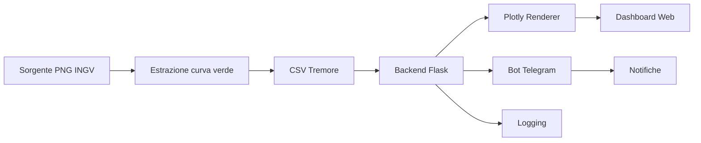

# EtnaMonitor — Panoramica

  

EtnaMonitor è una piattaforma dedicata al monitoraggio del tremore vulcanico dell'Etna. Il sistema raccoglie i grafici pubblici dell'INGV, elabora automaticamente la curva del tremore e fornisce visualizzazioni interattive e notifiche tempestive.

Obiettivi principali:
- Visualizzazione web in tempo reale con grafico logaritmico e soglia di allerta configurabile.
- Analisi automatica dell'ultima finestra temporale per riconoscere trend in crescita, stabili o in calo.
- Sistema di alert tramite bot Telegram con gestione utenti Free/Premium e riduzione dello spam.


---

## Indice
1. [Architettura del Sistema](#architettura-del-sistema)
2. [Funzionalità Chiave](#funzionalità-chiave)
3. [Dipendenze & Requisiti](#dipendenze--requisiti)
4. [Setup Locale (Step-by-step)](#setup-locale-step-by-step)
5. [Configurazione (.env.example)](#configurazione-envexample)
6. [Pipeline Dati (PNG INGV → CSV → Grafico)](#pipeline-dati-png-ingv--csv--grafico)
7. [Notifiche Telegram](#notifiche-telegram)
8. [Gestione Utenti e Premium](#gestione-utenti-e-premium)
9. [Logging & Monitoraggio](#logging--monitoraggio)
10. [Deploy (Ambiente di Produzione)](#deploy-ambiente-di-produzione)
11. [Sicurezza & Privacy](#sicurezza--privacy)
12. [Troubleshooting (FAQ Tecnica)](#troubleshooting-faq-tecnica)
13. [Roadmap](#roadmap)
14. [Licenza & Note Legali](#licenza--note-legali)
15. [Contatti](#contatti)

---

## Architettura del Sistema


### Componenti principali
- **Backend Flask**: fornisce API REST, gestione sessioni, orchestrazione pipeline e autenticazione utenti.
- **Plotly**: genera grafici interattivi con scala logaritmica, soglia rossa e annotazioni dell'ultimo aggiornamento.
- **Script analitici**: estraggono la curva verde dal PNG, applicano filtri e calcolano statistiche dell'ultima finestra.
- **Gestione utenti**: database con ruoli Free/Premium, salvataggio impostazioni personalizzate e cronologia accessi.
- **Bot Telegram**: invia alert, gestisce iscrizioni, conferma superamento soglia e applica hysteresis.
- **Storage locale (file/CSV)**: repository dei dati elaborati (`data/`) e log (`logs/`) con rotazione.
- **Logging**: centralizza eventi applicativi, notifiche e anomalie pipeline per audit e troubleshooting.

### Flusso dati
1. Scaricamento periodico del PNG INGV e parsing tramite script dedicati.
2. Normalizzazione della curva e scrittura su CSV.
3. Backend Flask carica i dati, esegue analisi statistica e prepara dataset per Plotly.
4. La dashboard web espone grafico interattivo e stato utenti, aggiornandosi automaticamente.
5. In parallelo il bot Telegram valuta le soglie per ogni utente e spedisce notifiche quando necessario.
6. Ogni passo registra log strutturati per verificabilità e auditing.

## Funzionalità Chiave
- **Dashboard web**: tema scuro, grafico interattivo con zoom, soglia rossa configurabile, badge di stato ultimo aggiornamento e trend.
- **Analisi automatica “ultima finestra”**: calcolo media mobile configurabile, identificazione trend (in crescita/stabile/in calo) e messaggistica in dashboard.
- **Sistema utenti**:
  - Free: soglia standard, accesso dashboard, log limitati.
  - Premium: soglie personalizzate, notifiche Telegram avanzate, storico eventi esteso.
- **Notifiche Telegram**: invio al superamento soglia, gestione hysteresis/debounce per evitare spam, alert riassuntivi.
- **Log eventi recenti**: elenco con timestamp, valore misurato, soglia applicata, esito alert visibile dalla dashboard.
- **Admin**: pannello opzionale per consultare utenti, promuovere/demozionare Premium e monitorare stato notifiche.

## Dipendenze & Requisiti
- **Runtime**: Python 3.11+, pip, virtualenv.
- **Librerie principali**: Flask, Plotly, pandas, Pillow o OpenCV (per analisi PNG), numpy, requests, python-dotenv, schedule (o cron equivalent), SQLAlchemy (per utenti), gunicorn (per deploy), loguru o logging standard.
- **Requisiti di sistema**: CPU dual-core, 2 GB RAM, 200 MB storage libero per dataset storici. Funziona su Linux, Windows e macOS.

## Setup Locale (Step-by-step)
```bash
# 1. Clonare il repository
git clone https://github.com/<ORGANIZZAZIONE>/etna-monitor.git
cd etna-monitor

# 2. Creare e attivare l'ambiente virtuale
python -m venv .venv
source .venv/bin/activate  # Windows: .venv\\Scripts\\activate

# 3. Installare le dipendenze
pip install -r requirements.txt

# 4. Configurare l'ambiente
cp .env.example .env  # oppure creare manualmente seguendo la sezione dedicata

# 5. Avviare il backend Flask
python app.py  # in alternativa: flask run

# 6. Aprire la dashboard
open http://127.0.0.1:5000  # Windows: start, Linux: xdg-open
```

## Configurazione (.env.example)
```env
FLASK_ENV=development
SECRET_KEY=<SET_A_SECURE_RANDOM_VALUE>
TELEGRAM_BOT_TOKEN=<TELEGRAM_BOT_TOKEN>
TELEGRAM_ALERT_INTERVAL_MIN=120
PREMIUM_CHECK_ENABLED=true
DEFAULT_ALERT_THRESHOLD_MV=2.0
DATA_DIR=./data
LOG_DIR=./logs
```

| Variabile | Descrizione |
|-----------|-------------|
| `FLASK_ENV` | Modalità di esecuzione Flask (`development` o `production`). |
| `SECRET_KEY` | Chiave segreta per sessioni e CSRF; generare valore robusto. |
| `TELEGRAM_BOT_TOKEN` | Token del bot ottenuto da BotFather. |
| `TELEGRAM_ALERT_INTERVAL_MIN` | Intervallo minimo tra notifiche per singolo utente (debounce). |
| `PREMIUM_CHECK_ENABLED` | Abilita la verifica delle funzionalità Premium. |
| `DEFAULT_ALERT_THRESHOLD_MV` | Soglia di alert predefinita per account Free in millivolt. |
| `DATA_DIR` | Directory per CSV e cache dati. |
| `LOG_DIR` | Directory per file di log applicativi. |

## Pipeline Dati (PNG INGV → CSV → Grafico)
1. **Download**: uno scheduler scarica periodicamente il grafico PNG pubblico fornito da INGV.
2. **Estrazione curva verde**: applicazione di una maschera HSV o filtro colore per isolare la curva del tremore; successiva pulizia tramite median blur e thinning per ottenere punti vettoriali.
3. **Conversione unità**: trasformazione della posizione dei pixel in valori di tremore in millivolt con scala log10 secondo la legenda del PNG.
4. **Persistenza**: salvataggio in CSV con schema `timestamp, valore_mV, media_mobile, note`. File archiviati in `data/` con rotazione giornaliera.
5. **Rendering**: Plotly genera grafico linea verde su asse Y logaritmico, sovrappone soglia rossa e indicatori dell'ultimo valore.
6. **Considerazioni**: gestione ritardi aggiornamento sorgente, retry con backoff esponenziale, notifiche di errore se il PNG non è aggiornato oltre una soglia temporale.

## Notifiche Telegram
- **Collegamento account**: l'utente fornisce il proprio `chat_id` tramite comando `/start`, che viene associato al profilo in dashboard.
- **Trigger alert**: viene inviato un messaggio quando la media dell'ultima finestra supera la soglia personalizzata. L'hysteresis evita notifiche ripetute finché il valore non rientra sotto la soglia meno un margine.
- **Frequenza consigliata**: impostare `TELEGRAM_ALERT_INTERVAL_MIN` tra 60 e 180 minuti per bilanciare tempestività e riduzione dello spam.
- **Best practice sicurezza**: non pubblicare il token del bot, archiviarlo solo nel file `.env` e limitare l'accesso ai log che contengono `chat_id`.

## Gestione Utenti e Premium
- **Registrazione/Login**: form con validazione email; password memorizzate con hashing (es. PBKDF2/Bcrypt). Possibile integrazione OAuth opzionale.
- **Dashboard**: badge che indica stato Free o Premium e riepilogo delle impostazioni personali.
- **Attivazione Premium**: pagamento manuale tramite link placeholder `<PAYPAL_DONATION_LINK>`; l'admin abilita lo stato Premium dal pannello dedicato.
- **Soglie personalizzate**: interfaccia per modificare il livello di allerta; validazione su range plausibili (es. 0.5–10 mV) con persistenza su database.

## Logging & Monitoraggio
- **Storage log**: file testuali in `./logs`, rotazione giornaliera e livelli (INFO, WARNING, ERROR). Possibile integrazione con `logging.handlers.RotatingFileHandler`.
- **Eventi alert**: ogni notifica registra timestamp, valore, soglia, utente e esito (inviato/scartato). I record sono consultabili dalla dashboard e via API admin.
- **Estensioni future**: esportazione verso ELK/Graylog o metriche Prometheus per dashboarding avanzato.

## Deploy (Ambiente di Produzione)
1. **Target**: servizi PaaS (Render, Fly.io) o VPS con Docker/gunicorn + Nginx come reverse proxy.
2. **Variabili ambiente**: replicare il contenuto di `.env` tramite segreti del provider. Non caricare file `.env` direttamente.
3. **Static & storage**: montare volumi persistenti per `data/` e `logs/`; configurare caching statici.
4. **Scheduler**: impostare cron job o worker separato per eseguire la pipeline PNG→CSV (es. `python etna_loop.py`).
5. **Hardening**: usare `SECRET_KEY` robusto, abilitare HTTPS, configurare header di sicurezza (HSTS, CSP), limitare rate sulle API e monitorare errori.

## Sicurezza & Privacy
- Non committare `.env`, token o database con dati reali; usare gitignore e segreti di deploy.
- Validare e sanificare input utente; proteggere form con CSRF token e rate limiting.
- Gestire sessioni server-side con scadenze definite e revoca manuale per account compromessi.
- Eseguire backup regolari di `data/` e `logs/` su storage cifrato; testare procedure di restore.
- Raccogliere solo dati minimi necessari; informare gli utenti sull'uso dei dati in modo conforme alle normative locali (es. GDPR).

## Troubleshooting (FAQ Tecnica)
- **Il grafico è piatto o sballato**: controllare che l'asse Y sia in scala log, verificare che il PNG INGV sia aggiornato e che la soglia sia correttamente impostata.
- **Non arrivano gli alert**: assicurarsi che il `chat_id` sia associato, il `TELEGRAM_BOT_TOKEN` sia valido, la finestra di analisi non sia troppo ampia e l'intervallo antispam non blocchi gli invii.
- **Errori di permessi su `data/` o `logs/`**: verificare i permessi della directory, su Linux usare `chmod 755` e su Windows eseguire come amministratore o modificare le ACL.
- **Timeout nel download PNG**: aumentare timeout richieste, abilitare retry con backoff e confermare che l'URL INGV sia raggiungibile dalla macchina.

## Roadmap
- Integrazione con mappa interattiva dei sensori regionali.
- Supporto a sensori fisici tramite LoRa/IoT per arricchire il dataset.
- Algoritmi di analisi predittiva basati su AI/ML.
- Esportazione dataset aggregati e anonimizzati per uso pubblico.
- Pannello admin avanzato con filtri, statistiche e gestione massiva utenti.

## Licenza & Note Legali
- **Licenza del codice**: da definire (placeholder).
- **Fonti dati**: grafici pubblici INGV, soggetti ai loro termini d'uso.

> EtnaMonitor utilizza esclusivamente grafici pubblici forniti dall’INGV per scopi divulgativi.  
> Il progetto non è affiliato né approvato da INGV. Tutti gli algoritmi di analisi, la piattaforma web e i sistemi di notifica sono proprietà intellettuale del progetto EtnaMonitor.

## Contatti
- Email: `<INFO_EMAIL>`
- Pagina About: `https://<DOMINIO_ETNAMONITOR>/about`

---
